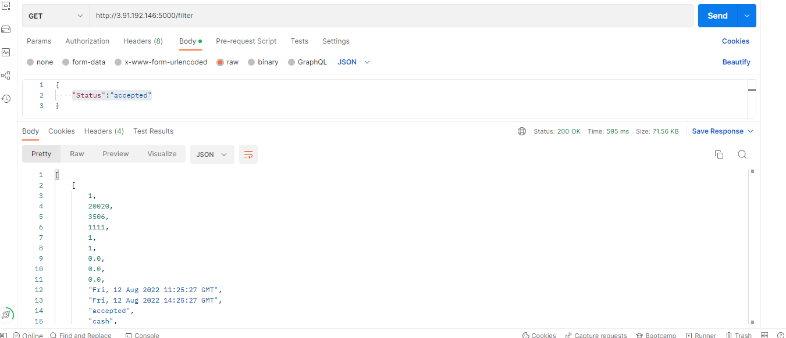
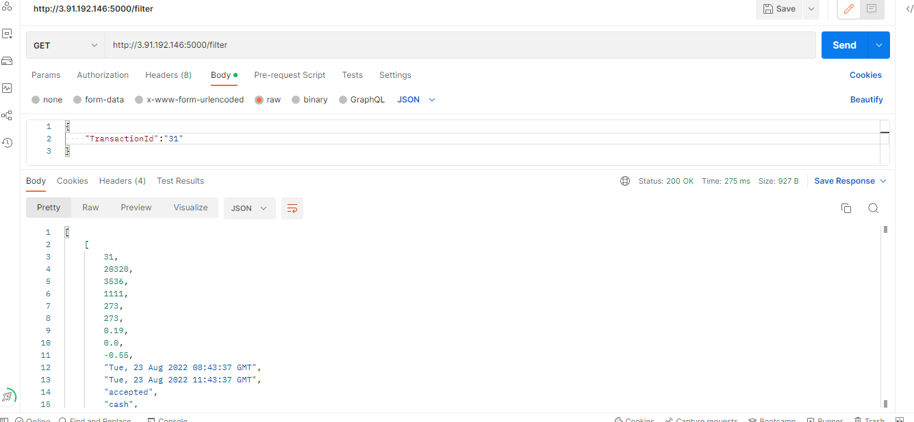

# Test API:
You can try upload your csv file on the this link: 

[Upload data](http://3.91.192.146:5000/)


After parsing CSV table you can try send GET request on this link http://3.91.192.146:5000/filter with params like "Status":"accepted". You can use this api to filter data from csv file in Postman. Example:


    
*Фільтрація і вивантаження попередньо збережених даних в JSON форматі в респонсі.

Вимоги до фільтрів:

пошук по transaction_id

пошук по terminal_id (можливість вказати декілька одночасно id)

пошук по status (accepted/declined)

пошук по payment_type (cash/card)

пошук по date_post по періодам (from/to), наприклад: from 2022-08-12, to 2022-09-01 повинен повернути всі транзакції за вказаний період
пошук по частково вказаному payment_narrative*


Transaction id:




# Using the API:

We will go through the steps of launching an app based on Flask and MySQL with parsing function and run with Docker and docker-compose.

When we start docker compose API, two containers are created **APP** and **DB**.

We begin with the following project layout:

**app.py** — contains the Flask app which connects to the database and exposes the REST API endpoint with HTML form for uploading csv file.

**init.sql** — an SQL script to initialize the database before the first time the app runs.

# Dockerfile

```
COPY . ./app
WORKDIR /app

RUN pip install -r requirements.txt

EXPOSE 5000
CMD python app.py

```

# Creating a docker-compose.yml

```
version: "2"
services:
  app:
    build: ./app
    links:
      - db
    ports:
      - "5000:5000"

```

- **build:** specifies the directory which contains the Dockerfile containing the instructions for building this service.

- **links:** links this service to another container.

- **ports:** mapping of Host : Container ports.

```
db:
    image: mysql:5.7
    ports:
      - "3306:3306"
    environment:
      MYSQL_ROOT_PASSWORD: root
    volumes:
      - ./db:/docker-entrypoint-initdb.d/:ro

```

- **image:** writing a new Dockerfile, we are using an existing image from a repository.

- **environment:** adding environment variables to assign password to the database.

- **ports:** we use port 3306 to connect to the database.

- **volumes:** we want the container to be initialized with our schema, so we connect the directory containing our init.sql script to the entry point for this container, which runs all .sql scripts in the given directory.

# Configure connection to the database in app.py.

```
# Database
mydb = mysql.connector.connect(
  host="db",
  user="root",
  password="root",
  port= "3306",
  database="csvdata"
)

```

We are connecting as root with the password configured in the docker-compose file. We have to use the name ‘db’ because this is the name of the service we defined.

# Running the app.

Go to the main directory in the terminal and enter the command:

```
docker-compose up
```

We should get:

```
app_1  |  * Running on http://0.0.0.0:5000/ (Press CTRL+C to quit)

```
